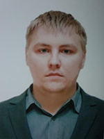

# **Dmitriy Tiunov**
***
## *Contacts:* ##
- Perm', Russia;
- E-mail: tiynov2@mail.ru
- GitHub: Darkonic10
- Discord: Darko#7387
***
## *Summary:* ##
I completed my bachelor’s and master’s degrees with honors in economics. In recent years, I have worked in a different specialty. There is no experience in this specialty, but this direction is very attractive. Ready to learn new things with interest and overcome difficulties to achieve results.
## *Skills:* ##
There are initial programming skills based on passing courses on the basics of the Python language.
## *Code:* ##
```
function dataReverse(data) {
  const bytes = [];
  let reversedBytes = []
  
  for (let i = 0; i < data.length; i += 8) {
    const byte = data.slice(i, i + 8);
    bytes.push(byte);
  }
  
  for (let i = bytes.length - 1; i >= 0; i--) {
    reversedBytes.push(bytes[i]);
  }
  
  const result = reversedBytes.flat()
  return result;
}
```
## *Projects:* ##
https://Darkonic10.github.io/rsschool-cv/cv
## *Education:* ##
Perm National Research Polytechnic University
## *Courses:* ##
- **Network IT University -** Python Programming Basics
- **WebJunior -** Intensive HTML and CSS
- **RS SCHOOL -** Front-end pre-school stage 0 (Partial self-study)
## *English language:* ##
B2 - Intermediate